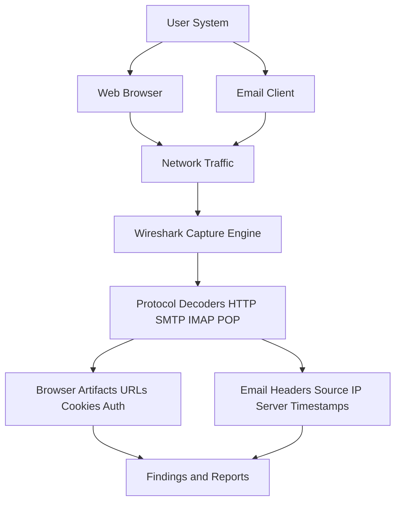
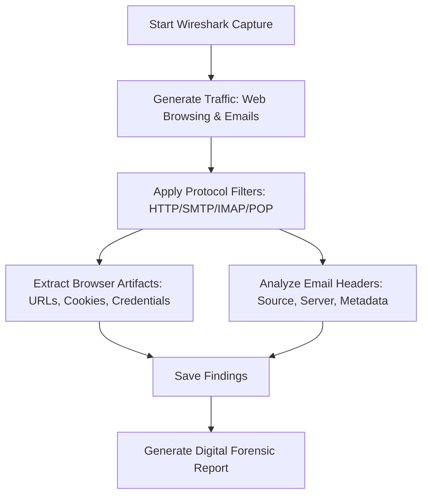

# Using-Wireshark---analyzing-web-browser-artifacts-email-header-analysis
## AIM:
To use Wireshark to analyze web browser activities and inspect email headers from captured network traffic.
## Architecture Diagram:

## DESIGN STEPS:
### Step 1:
- Install Wireshark and ensure correct network adapter selection.
- Enable packet capturing for your active interface (Wi-Fi/Ethernet).

### Step 2:
**Web Browser Artifact Analysis**
- Open a browser and visit websites with login forms (use dummy credentials).
- In Wireshark, filter traffic with:
    - ```http``` for normal HTTP requests
    - ```http.cookie``` for cookies
    - ```http.authbasic``` for basic authentication
- Identify:
    - URLs visited
    - GET/POST requests
    - Cookies & session IDs
    - Credentials (if plaintext HTTP is used)
### Step 3:
- Capture email traffic by sending/receiving emails (dummy mail server or provided PCAP).
- Use filters:
    - ```smtp``` (Simple Mail Transfer Protocol)
    - ```pop``` / ```imap``` (for received mail)
- Inspect email headers:
    - Source IP
    - Mail server hostname
    - Timestamps
    - Possible forged headers
## PROGRAM:


## OUTPUT:
Captured Web Activity and Email Header Information


img width="1920" height="1080" alt="Screenshot (421)" src="https://github.com/user-attachments/assets/fbd91315-4065-4d0c-a08f-93ce4f65c3e3" />


## RESULT:
Web browser artifacts and email headers were successfully analyzed using Wireshark.

